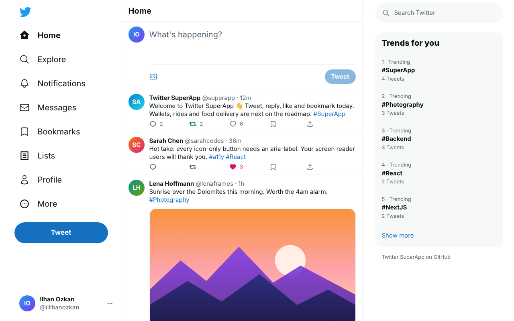
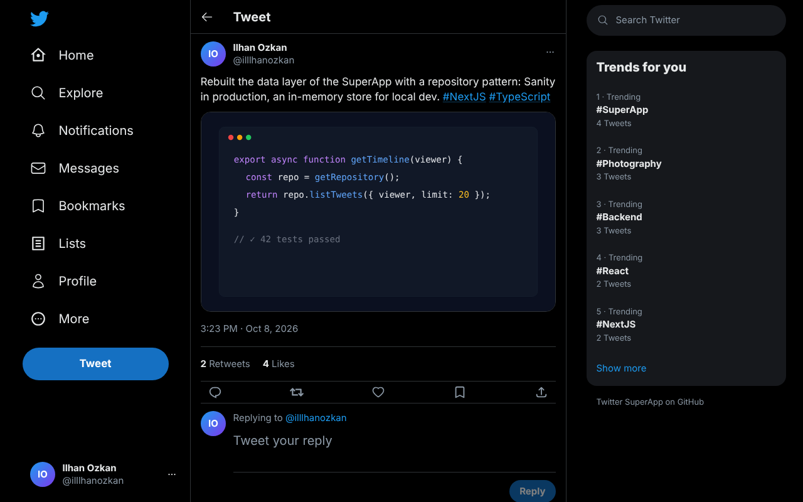
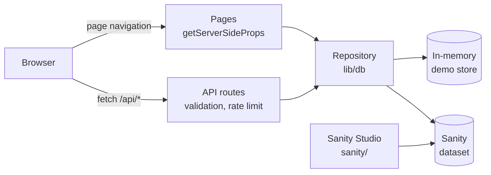

# Twitter SuperApp

A Twitter clone on its way to becoming a SuperApp: tweet, reply, like, Retweet and
bookmark today, with payments, rides and food delivery on the roadmap.



| Lights out                                         | Phone                                                                          |
| -------------------------------------------------- | ------------------------------------------------------------------------------ |
|  |  |

## App Mission

This app aims to turn Twitter into a SuperApp.

## Features

- **Tweet** from the home composer or the compose dialog (`n`): 280 characters counted the
  way people see them, an optional image URL, and `Ctrl`/`⌘` + `Enter` to send.
- **Talk**: reply on a tweet's own page, like, Retweet, bookmark, copy a link, and delete
  your own tweets. Reactions update instantly and roll back if the server says no.
- **Discover**: search tweets by text, username or name, trends computed from real
  #hashtags, profiles with Tweets and Likes tabs, and notifications for likes, Retweets
  and replies.
- **Read it your way**: light, "Lights out" and automatic themes, layouts for phones,
  tablets and desktops, full keyboard support (`?` lists the shortcuts, which can be
  turned off), and WCAG AA colors. All main pages are checked with axe in both themes.
- **Runs anywhere**: zero configuration with the bundled demo data, or backed by
  [Sanity](https://www.sanity.io) with its own Studio for editing and moderation.

## Getting started

Requires Node.js 22.12 or newer (see `.nvmrc`).

```bash
npm ci
npm run dev   # http://localhost:3000
```

No configuration is needed: without Sanity credentials the app runs on a bundled
in-memory demo dataset (8 users, 20 tweets plus one hidden by moderation, replies,
likes, Retweets and bookmarks).
Changes you make are kept until the server restarts.

### Scripts

| Script                         | What it does                                                       |
| ------------------------------ | ------------------------------------------------------------------ |
| `npm run dev`                  | Development server                                                 |
| `npm run build`                | Production build                                                   |
| `npm start`                    | Serves the production build                                        |
| `npm run lint`                 | ESLint (Next.js core web vitals + TypeScript rules)                |
| `npm run format`               | Prettier (with Tailwind class sorting); `format:check` in CI       |
| `npm run typecheck`            | TypeScript check                                                   |
| `npm test`                     | Unit, component and repository contract tests (Vitest)             |
| `npm run test:e2e`             | End-to-end and accessibility tests (Playwright + axe)              |
| `npm run seed:sanity`          | Exports the demo dataset as NDJSON for a Sanity import             |
| `npm run audit:ledger`         | Checks the demo-credit ledger's invariants (Sanity: needs a token) |
| `npm run check:sanity-privacy` | Fails if private Sanity documents are readable without a token     |

`npm run test:e2e` runs against `npm run build` output. The first run needs a browser:
`npx playwright install chromium`.

## Architecture



| Path                      | What lives there                                               |
| ------------------------- | -------------------------------------------------------------- |
| `pages/`                  | Routes; `pages/api/` is the REST API                           |
| `components/`             | UI: `layout/`, `tweet/`, `profile/`, `settings/`, `common/`    |
| `slices/`, `store.ts`     | Redux Toolkit state (tweets, timelines, replies, session, UI)  |
| `lib/db/`                 | Repository interface with Sanity and in-memory implementations |
| `lib/api/`, `lib/auth.ts` | API handler wrapper, validation, rate limiting, current user   |
| `lib/server/`             | Server data for pages (`withPageState`)                        |
| `sanity/`                 | Sanity Studio v6 (content model, moderation)                   |
| `e2e/`                    | Playwright end-to-end and accessibility tests                  |

### Frontend

Next.js 16 (pages router) with React 19, Redux Toolkit and Tailwind CSS.

- Every page renders on the server: `getServerSideProps` reads the repository directly
  (`lib/server/pageState.ts`) and hands the data to the Redux store as `initialState`,
  so the first paint already contains the timeline.
- Client-side changes go through the REST API with optimistic updates that settle on the
  latest click.
- Colors are CSS variables (`styles/globals.css`) with a light and a dark set; an inline
  script applies the saved theme before the first paint. Text colors meet WCAG AA (4.5:1).
- Layout follows Twitter's breakpoints: full sidebar from 1280px, an icon rail below,
  the trends column from 1024px, and a bottom tab bar on phones.

### Data

All reads and writes go through one repository interface (`lib/db/types.ts`) with two
implementations, chosen by `DATA_SOURCE`:

| Source   | When it is used                             | Notes                                                                               |
| -------- | ------------------------------------------- | ----------------------------------------------------------------------------------- |
| `memory` | Default when `SANITY_PROJECT_ID` is not set | Seeded from `lib/db/seed.ts`. Per process, so not for serverless production         |
| `sanity` | Default when `SANITY_PROJECT_ID` is set     | Reads without the CDN so new tweets show up at once. Writes need `SANITY_API_TOKEN` |

The same contract test suite (`lib/db/repository.contract.test.ts`) runs against both:
the Sanity implementation executes its real GROQ queries with
[groq-js](https://github.com/sanity-io/groq-js), and a final test checks that both return
the same results for the same reads. Search works like GROQ's `match` in both: every word
of the query must start a word in the tweet, the username or the name.

The Sanity Studio lives in [`sanity/`](./sanity/README.md).

### API

The app talks to a small REST API under `/api` (tweets, replies, likes, Retweets,
bookmarks, users, notifications, trends). Every request acts as the account in
`DEMO_USERNAME`, decided on the server; writes are validated, rate limited and
same-origin only. See [docs/API.md](./docs/API.md).

The SuperApp features (wallet, messages, food, rides, stories, channels) share one
demo-credit ledger and a set of extension points, described in
[docs/SUPERAPP.md](./docs/SUPERAPP.md).

## Deployment

All settings are environment variables (see `.env.example`):

| Variable               | Purpose                                                                    |
| ---------------------- | -------------------------------------------------------------------------- |
| `DATA_SOURCE`          | `memory` or `sanity` (default: `sanity` when a project id is set)          |
| `SANITY_PROJECT_ID`    | Sanity project; `SANITY_DATASET` defaults to `production`                  |
| `SANITY_API_TOKEN`     | Editor token for writes (server-side only); without it Sanity is read-only |
| `DEMO_USERNAME`        | The account every visitor acts as (default `illlhanozkan`)                 |
| `READ_ONLY`            | `true` rejects all writes and hides write controls                         |
| `WRITE_RATE_LIMIT`     | Writes per client per minute (default 30, `0` disables)                    |
| `TRUST_PROXY`          | Behind a reverse proxy: trust the hop it appends to `X-Forwarded-For`      |
| `NEXT_PUBLIC_SITE_URL` | Public URL, used for absolute link-preview (Open Graph) image URLs         |

> **There is no sign-in yet.** Every visitor acts as `DEMO_USERNAME`, so a public
> deployment backed by Sanity with a write token lets anyone post as that account.
> Set `READ_ONLY=true` for public demos until authentication is added.

The in-memory store lives in one server process, so use it for local development,
demos and previews; use Sanity for anything that has to persist.

## Roadmap

The SuperApp features this project is heading towards:

- [ ] Twitter accounts have balance.
- [ ] Orders can be made via Tweets.
- [ ] Payment can be made via Twitter chat.
- [ ] Business account type created for businesses.
- [ ] Food delivery and ordering services created.
- [ ] Trips can be made with a driver booking (like Uber).
- [ ] Users can create stories (like Twitter Fleets).
- [ ] Live broadcasts are possible (like TikTok, Instagram, Twitch).
- [ ] Group chat channels added (like Discord, Telegram).

Building blocks still missing for them: sign-in, direct messages, follows and Lists
(the Messages and Lists pages are placeholders today).
