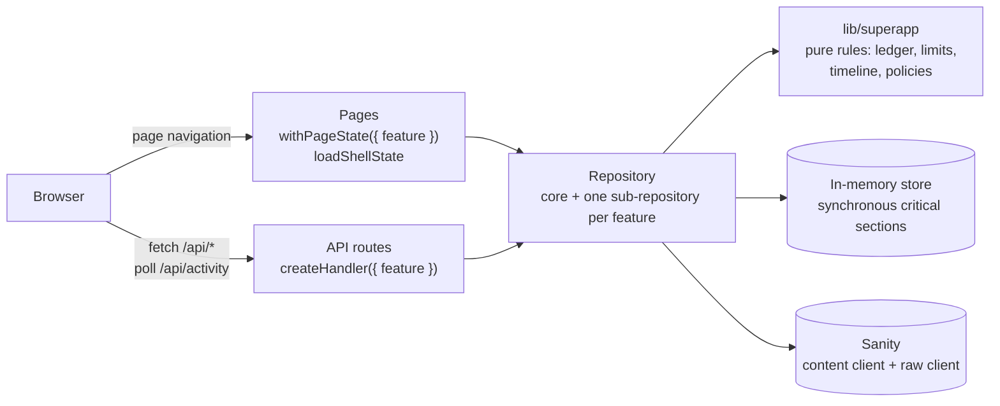

# SuperApp architecture

The SuperApp features turn the Twitter clone into a place where you can also
pay friends, order food, book rides, post stories and chat. This document
explains how they are built: the parts every feature shares, the demo-credit
ledger, privacy, the extension points, and how to add a feature.

> **Demo credits only.** Every balance is in demo credits: they have no cash
> value and can't be bought, withdrawn or exchanged. There is no payment
> processor anywhere. Businesses, drivers and plates are fictional, and
> places are public Ankara landmarks with approximate coordinates.

The REST API is in [API.md](API.md#superapp-conventions); each feature has
an API page under [`api/`](api/) and a feature page under
[`features/`](features/).

## Features

| Feature              | What you can do                                                           | Ships in                         | Docs                                                     |
| -------------------- | ------------------------------------------------------------------------- | -------------------------------- | -------------------------------------------------------- |
| Wallet and tips      | Balance, activity, receipts, payment requests; send, request, add, tip    | foundation (API) + `wallet` (UI) | [API](api/wallet.md) · [feature](features/wallet.md)     |
| Messages             | Direct conversations with payments, requests and shared Tweets            | `messages` PR                    | [API](api/messages.md) · [feature](features/messages.md) |
| Channels             | Public group conversations with roles and moderation                      | `channels` PR                    | [API](api/channels.md) · [feature](features/channels.md) |
| Businesses and menus | Business profiles (foundation), menus, product cards on Tweets, Food hub  | foundation (data) + `business`   | [API](api/shop.md) · [feature](features/shop.md)         |
| Orders               | Order from a Tweet or a menu, track it, cancel and refund; Business board | `orders` PR                      | [API](api/orders.md) · [feature](features/orders.md)     |
| Rides                | Quotes, booking, a schematic map, trip progress, cancel and refund, tips  | `rides` PR                       | [API](api/rides.md) · [feature](features/rides.md)       |
| Stories              | A tray on Home, an accessible viewer, a composer, viewers, replies in DMs | `stories` PR                     | [API](api/stories.md) · [feature](features/stories.md)   |
| Live broadcasts      | Not built: it needs a video streaming service                             | —                                | [Live](#live)                                            |

A feature whose PR has not shipped is **off**: its navigation, tiles and
buttons are hidden, and its pages and API answer 404. Nothing half-built is
ever shown.

## Architecture



### One repository, one sub-repository per feature

`Repository` (`lib/db/types.ts`) keeps the core methods (tweets, replies,
reactions, users, trends, notifications) and gains one sub-repository per
feature: `repo.wallet`, `repo.business`, `repo.shop`, `repo.orders`,
`repo.rides`, `repo.stories`, `repo.messages` and `repo.channels`. Each
interface lives in `lib/db/<feature>/types.ts`.

Every feature's sub-repository is a `FeatureRepository`:

- `implemented`: the feature's PR has shipped. Stubs say `false`.
- `configured`: the data source can serve it. On Sanity the private
  features (wallet, messages, channels, orders, rides) need
  `SANITY_API_TOKEN`; shop and stories are public and always readable.
- `notifications(username, limit)` and `liveActivity(username)`, which the
  shared notifications timeline and the app shell merge.

`repo.featureStatus(id)` combines these with `DISABLED_FEATURES` into
**off** (not built, or disabled), **unconfigured** (built, but Sanity has no
token) or **on**. `repo.features` and `GET /api/me` report which are on.

### Pure rules, two stores

Domain logic is written once, as pure functions in `lib/superapp/`: money
formatting and parsing, limits, the ledger planner, payment requests,
business hours and status, places and distances, stage timelines, feature
flags and the authorization policies (`policy/*`). Both stores call them, so
they can't disagree, and they are unit-tested without any store.

- **Memory** (`lib/db/memory.ts` and `lib/db/memory/*`): each feature has a
  state (`create<Feature>MemoryState(seed)`) and a repository
  (`createMemory<Feature>(deps)`). The state is process-wide on
  `globalThis`, so it is shared by API routes and server-rendered pages, and
  resets on restart. Like Tweets and replies, it is capped (see
  `DEFAULT_MEMORY_LIMITS`), but money records are never evicted: at capacity,
  new money movement is refused instead.
- **Sanity** (`lib/db/sanity/*`): two clients. `content` reads published
  core documents; `superapp` uses the `raw` perspective for every SuperApp
  read and write (see [Privacy](#privacy)). Every SuperApp query filters by
  `_type`, excludes drafts and release versions with `PUBLISHED`
  (`lib/db/sanity/groq.ts`), and passes values as parameters. GROQ never
  calls `now()`: `$now` comes from the injected clock.

### API

Routes use `createHandler(routes, { feature })` (`lib/api/handler.ts`). It
checks, in order: the method (405), the feature (off: 404 "This feature is
turned off"; unconfigured: 503 "Wallet needs SANITY_API_TOKEN on this
deployment"), then `READ_ONLY`, the same-origin rule and the per-client write
limit. Domain errors (`lib/db/errors.ts`) map to statuses and codes in one
place (`toApiError`).

On top of that, money routes require an `Idempotency-Key`
(`lib/api/idempotency.ts`) and spend a per-user budget
(`assertActorLimit`, `lib/api/actorLimits.ts`), checked after validation so a
rejected request costs nothing. Bodies never name the acting user: identity
always comes from `lib/auth.ts`.

### Pages and the app shell

- `withPageState(load, { feature })` (`lib/server/pageState.ts`) answers 404
  unless the feature is on, and adds the shell's state.
- `loadShellState` (`lib/server/shell.ts`) reads the wallet, the activity
  counts and the businesses you manage with `Promise.allSettled`: a failing
  feature read degrades its widget (no wallet card, no badge), never the
  page.
- A page sets `Page.shell` (`types/PageShell.ts`) for the wide layout (990px
  main, no right column), focus mode (no tab bar on phones) or no compose
  button.
- `AppShell` polls `GET /api/activity` every 30 seconds while the page is
  visible and online, and early at the next known change (`nextChangeAt`).
  Badges and the "Happening now" card come from it.

### Client

- `request()` (`lib/client/request.ts`) takes an `idempotencyKey`. With one,
  it retries **once**, with the same key, after a network error or a 409
  `conflict`, never after anything else, so a retry can't charge twice.
- Hooks: `usePolling` (pauses while hidden or offline, backs off on errors),
  `useIdempotencyKey` (one key per operation: kept across retries, new when
  the amount or recipient changes or after a success) and
  `useServerClock` (renders "arrives in 3 min" from the server's clock).
- **Money is never optimistic.** Likes still are, but anything that moves
  credits waits for the server, and every money response carries the
  actor's wallet (`balanceChanged`).
- Each feature has its own slice in `slices/`. A slice registers its own
  side effects with `startAppListening` (`slices/listeners.ts`) and names
  the state that survives navigation in `followsNavigation`, so `store.ts`
  never changes for a feature.

### Time without background work

Nothing runs in the background: no workers, cron or WebSockets, which
serverless hosting can't guarantee. Orders and rides store absolute
timestamps (accepted at, on the way at, picked up at, …) when they are
created, and every read derives the current stage from them and the server's
clock (`lib/superapp/timeline.ts`). Time-derived responses include
`serverNow`; clients poll.

`SUPERAPP_TIME_SCALE` (1 to 600, default 1) speeds up new orders and rides
for demos and tests. It is applied when a record is created, so old records
never change speed, and windows people act in never shrink below real-time
floors: at least 15 seconds to cancel an order and 30 seconds to cancel a
ride for free. Seeds always use scale 1.

### Seed worlds

`createSeedData(now, { world })` builds one of two worlds:

- `core`: the original demo data, exactly. The core test suites run on it,
  so their counts never change.
- `superapp` (the default): core plus every feature's seed. Each feature's
  `create<Feature>Seed(ctx)` returns its own records and a **contribution**
  to the shared parts (Tweets, replies, reactions, transfers). The composer
  merges them and folds all transfers through the ledger planner, so the
  seeded world obeys the same rules as the app.

`npm run seed:sanity` exports the world for `sanity dataset import`.

## Ledger and holds

Every amount is an integer number of **cents** of demo credits (`1250` is
12.50 credits). Amounts are always shown as text ("12.50 credits"), signed
amounts carry a sign and a spoken direction ("received"), and there are no
currency symbols anywhere.

### Transfers and wallets

- **Every movement is one immutable `transfer`**: from a wallet (or from
  nobody, for issued demo credits) to a wallet, with an amount above 0.
  The only field ever changed afterwards is `reversedBy`, set once when the
  transfer is refunded. Nothing is deleted: deleting a Tweet keeps its tips.
- **One wallet per user** (`wallet-<lower-case username>`) stores the
  `balance`, which changes only in the same atomic write as the transfers
  that explain it. A wallet that doesn't exist reads as 0 and not frozen;
  receiving credits creates it.
- Money enters only through capped top-ups, the seed, and the demo bot that
  funds simulated customer orders. There is no cap on receiving, so a busy
  business never fails a buyer and balances can't leak through errors.

### Holds instead of escrow

Order and ride payments go straight to the business or driver, but **held**:
the transfer carries `holdUntil` (delivery or pickup time).

- `pending(u)` is the sum of unrefunded credits to `u` still on hold;
  `available(u) = balance(u) − pending(u)`.
- **Debits check `available`**, so held credits can't be spent.
- A **refund** reverses a held credit while it is still held, at most once,
  for the same amount with the parties swapped. It debits the `balance`, not
  `available`. Because held credits can't be spent, the balance always
  covers them, so **a refund can never fail for lack of funds**.
- Funds become available simply because time passes. There is no
  settlement step to run.

### Invariants

The contract tests check these in both stores after every money scenario and
after a 300-operation randomized run, and `npm run audit:ledger` checks them
against a real data source:

1. Every wallet's balance equals what it received minus what it sent.
2. The sum of all balances equals the credits ever issued.
3. No balance is negative.
4. `0 ≤ pending ≤ balance`.
5. A transfer is refunded at most once, by a transfer that reverses it with
   the same amount and swapped parties.
6. One idempotent operation creates at most one set of records.

### The planner

`planLedger(view, transfers)` (`lib/superapp/ledger.ts`) applies an
operation's transfers, in order, to a working copy of the wallets and either
returns the new balances or throws a domain error: insufficient funds, a
frozen wallet, or a refund outside its window. Credits within an operation
count before later debits (the demo bot is funded, then pays). Both stores
call it inside their atomic section.

### Idempotency

Every request that moves money carries an `Idempotency-Key`. The id of the
operation's primary record is derived from the acting user, the kind of
operation and the key (`operationId`), and the record stores a fingerprint
of the request body (`fingerprint`):

- The record exists with the same fingerprint: the original result is
  returned with the original status and `Idempotent-Replayed: true`.
- It exists with a different fingerprint: 422 `idempotency_key_reused`.
- It doesn't exist: the operation runs, and creating that record is part of
  its atomic write. Two identical requests racing produce one effect.

Refunds use the natural id `refund-<payment id>`, so they happen at most
once without a key. State changes (decline a request, cancel an order) are
idempotent by their target state: repeating one answers 200.

### Concurrency

- **Memory:** `ledger.commit` is synchronous by type, and repositories call
  it before any `await`. Node runs it to completion, so concurrent requests
  serialize, and every check runs before the first write.
- **Sanity:** each attempt reads **one snapshot** (wallets with their
  revision, pending holds, freezes, the originals being refunded, extra
  counts) and writes **one transaction**:
  - a debited wallet is patched with `ifRevisionID`, so a concurrent change
    makes the transaction fail instead of overdrawing;
  - a plain credit is an `inc`, which commutes, so receivers never contend;
  - a refund is guarded on the original transfer's revision.

  On a 409 or 404 the ledger re-reads the primary record: if it now exists
  the call is a replay, otherwise it retries (at most 3 attempts with a
  jittered 10–60 ms pause), then answers 409 `conflict` "Busy, try again".

- **Per-user counts** that must be exact (pending requests, top-ups per day,
  active orders, one active ride) lock the user's wallet revision: the count
  is read in the same snapshot and the wallet is written with
  `ifRevisionID`, so two such operations for one user serialize.

### Freezes

A moderator freezes a wallet by creating a `walletFreeze` document in the
Studio and unfreezes it by deleting it (in memory: `state.wallet.frozen`).
A frozen wallet can't send, tip, top up, pay, order or book, and can't
receive. Refunds always go through, in both directions. A business with a
frozen wallet can't take orders, and frozen drivers aren't matched.

Freezes are checked when an operation reads its snapshot, not guarded: a
freeze created between that read and the write can let one movement through.
That is deliberate (eventual moderation).

### Limits

All in `lib/superapp/limits.ts` (and mirrored in `sanity/env.ts`):

| Limit                     | Value                                                       |
| ------------------------- | ----------------------------------------------------------- |
| Payment or request        | 0.50 to 200.00 credits                                      |
| Tip                       | 0.50 to 50.00 credits                                       |
| Top-up                    | 25, 50 or 100 credits; balance at most 1,000.00; 3 per 24 h |
| Pending outgoing requests | 10; a request expires after 7 days                          |
| Order                     | at most 200.00 credits, 10 lines, 20 of an item; 5 active   |
| Ride                      | fare at most 200.00 credits; 1 active ride                  |
| Memory ledger             | 50,000 transfers                                            |

## Privacy

- **Private ids.** Wallets, transfers, payment requests, orders, rides,
  driver locks, story views, conversations, members and messages are stored
  as `private.<key>`. Sanity never returns documents under a path to a
  request without a token, even from a public dataset.
  `lib/db/sanity/ids.ts` is the only place that adds or strips the prefix.
- **Dot-free keys everywhere else.** DTO ids are the keys, identical in both
  stores. The API accepts only keys matching `KEY_PATTERN` (no dots), adds
  the prefix on the server and always filters by `_type`, so a route can
  never address another kind of document.
- **The raw client.** Whether Sanity's `published` perspective returns path
  documents is unverified offline; `raw` returns them to token holders and
  hides them from everyone else. Raw also returns drafts, so every query
  excludes them itself, and in tests a query without the `PUBLISHED` filter
  throws.
- **Public SuperApp types:** `businessProfile`, `product`, `driverProfile`,
  `story` and `walletFreeze`.
- **Checks.** Offline, the fake Sanity client's `anonymous` mode proves that
  the whole seeded world exposes no private document. Against a real
  project, `npm run check:sanity-privacy` queries anonymously by type and by
  path and fails if anything comes back.
- **Visibility in the API.** Records only their parties may see answer 404
  to everyone else, so ids reveal nothing. The rules are pure policy
  functions (`lib/superapp/policy/*`) shared by routes and pages.
- **Direct messages are not encrypted.** Anyone with access to the dataset
  can read them, for example with Vision. The Studio desk never lists direct
  conversations, but that is a convenience, not a protection.
- **No sign-in yet.** Every visitor acts as `DEMO_USERNAME`, so on a
  writable deployment anyone can spend that account's demo credits. Issuing
  is capped and per-user budgets apply; set `READ_ONLY=true` for public
  demos.

## Studio

Every SuperApp schema file (`sanity/schemaTypes/<feature>.ts`) exports the
same five things (`SchemaFile`, `sanity/schemaTypes/schemaFile.ts`):

| Export              | Used for                                                                                                           |
| ------------------- | ------------------------------------------------------------------------------------------------------------------ |
| `types`             | Its document types                                                                                                 |
| `structureItems(S)` | Its desk entries, shown in its group under the SuperApp divider (Money, Food, Rides, Stories, Channels)            |
| `APP_CREATED_TYPES` | Types only the app creates: never offered in a "Create" menu                                                       |
| `LOCKED_TYPES`      | No document actions at all (and the type is `readOnly`): the ledger, orders, rides, locks                          |
| `MODERATED_TYPES`   | Publish only, so a moderator can change the open fields (`blocked`, `removed`) but not create, duplicate or delete |

`sanity/schemaTypes/index.ts`, `sanity/structure.ts` and
`sanity/sanity.config.ts` combine them. Types the app patches itself
(`businessProfile`, `product`, `driverProfile`) and `walletFreeze` are
`liveEdit`, so publishing an older draft can never undo the app's change.

The Studio is a separate package, so `sanity/env.ts` restates the app's
limits, places and enumerations; `test/studioEnv.test.ts` fails when they
drift. See [sanity/README.md](../sanity/README.md) for moderation and
privacy notes.

## Extension points

The foundation edits every shared file once and points it at a file each
feature owns. Until a feature ships, its file is a stub: sub-repositories
report `implemented: false`, read as empty and refuse writes with 501;
components render nothing; hooks return `[]`; seeds return nothing.

| Shared file (foundation only)                                                                    | Calls or renders                                                                                                                    | Feature-owned file                                                                                                                                                                      |
| ------------------------------------------------------------------------------------------------ | ----------------------------------------------------------------------------------------------------------------------------------- | --------------------------------------------------------------------------------------------------------------------------------------------------------------------------------------- |
| `lib/db/types.ts`                                                                                | the sub-repository interfaces                                                                                                       | `lib/db/<feature>/types.ts`                                                                                                                                                             |
| `lib/db/memory.ts`                                                                               | `create<Feature>MemoryState`, `createMemory<Feature>`                                                                               | `lib/db/memory/{shop,orders,rides,stories,messages,channels}.ts`                                                                                                                        |
| `lib/db/sanity/repository.ts`                                                                    | `createSanity<Feature>`                                                                                                             | `lib/db/sanity/{shop,orders,rides,stories,messages,channels}.ts`                                                                                                                        |
| `lib/db/seed.ts`, `lib/db/sanity/seed.ts`                                                        | `create<Feature>Seed(ctx)`, `<feature>SanityDocuments(seed)`                                                                        | `lib/db/seeds/<feature>.ts`, `lib/db/sanity/seeds/<feature>.ts`                                                                                                                         |
| `lib/server/shell.ts`, `lib/server/activity.ts`                                                  | `messages.unreadConversations`, `<feature>.liveActivity`                                                                            | the repositories                                                                                                                                                                        |
| `pages/index.tsx`                                                                                | `stories.listTray`, `<StoriesTray>`                                                                                                 | `components/stories/StoriesTray.tsx`                                                                                                                                                    |
| `lib/server/profile.ts`, `components/profile/ProfileHeader.tsx`                                  | `business.getBusiness`; `<OrderButton>`, `<BusinessInfo>`, `<MessageProfileAction>`, `<SendCreditsProfileAction>`, `<RideHereLink>` | `components/shop/{OrderButton,BusinessInfo}.tsx`, `components/messages/MessageProfileAction.tsx`, `components/wallet/SendCreditsProfileAction.tsx`, `components/rides/RideHereLink.tsx` |
| `components/tweet/TweetActions.tsx`                                                              | `<TipAction>`                                                                                                                       | `components/wallet/TipAction.tsx`                                                                                                                                                       |
| `components/tweet/TweetMenu.tsx`                                                                 | `useWalletTweetMenuItems(tweet)`, then `useMessageTweetMenuItems(tweet)`, always in this order                                      | `components/wallet/walletTweetMenuItems.ts`, `components/messages/messageTweetMenuItems.ts`                                                                                             |
| `components/tweet/{TweetCard,TweetDetail}.tsx`                                                   | `<ProductAttachment tweet variant>`                                                                                                 | `components/shop/ProductAttachment.tsx`                                                                                                                                                 |
| `components/tweet/Composer.tsx`                                                                  | attachment state, `<ComposerProductPicker>`                                                                                         | `components/shop/ComposerProductPicker.tsx`                                                                                                                                             |
| `components/layout/AppShell.tsx`                                                                 | `WalletDialogs`, `MessageDialogs`, `OrderDialogs`, `StoryDialogs` (loaded with `next/dynamic`)                                      | `components/{wallet,messages,orders,stories}/*Dialogs.tsx`                                                                                                                              |
| `pages/wallet/index.tsx`                                                                         | `<WalletActions>`, `<WalletRequests>`                                                                                               | `components/wallet/{WalletActions,WalletRequests}.tsx`                                                                                                                                  |
| `pages/services.tsx`                                                                             | `<BusinessCarousel>`                                                                                                                | `components/shop/BusinessCarousel.tsx`                                                                                                                                                  |
| `components/notifications/registry.ts`                                                           | core and wallet renderers, then each feature's (unknown types fall back to "actor · time" and a link)                               | `components/{orders,rides}/notificationRenderers.tsx`                                                                                                                                   |
| `store.ts`                                                                                       | every slice and its `followsNavigation`                                                                                             | `slices/{walletUi,messages,channels,cart,orders,rides,stories}Slice.ts`                                                                                                                 |
| `sanity/schemaTypes/index.ts`, `sanity/structure.ts`, `sanity/sanity.config.ts`, `sanity/env.ts` | each file's `types`, `structureItems`, `APP_CREATED_TYPES`, `LOCKED_TYPES`, `MODERATED_TYPES`                                       | `sanity/schemaTypes/{shop,orders,rides,stories,messages}.ts`                                                                                                                            |
| `docs/API.md`                                                                                    | links                                                                                                                               | `docs/api/<feature>.md`, `docs/features/<feature>.md`                                                                                                                                   |
| `playwright.config.ts`                                                                           | projects by file name                                                                                                               | `e2e/<feature>*.spec.ts`                                                                                                                                                                |

**The contract is frozen.** The types and signatures in the shared files are
what every feature builds on in parallel. A feature may add exports to its
own files, but a change to a shared signature goes in as a foundation fix-up
that every feature branch then rebases onto.

## Adding a feature

The steps for a planned feature (its id, stubs and slots already exist). A
new feature first needs a foundation change: a `FeatureId`, its
sub-repository on `Repository`, stub files and any slots it needs.

1. **Types.** Fill in `types/<Feature>.ts` and `lib/db/<feature>/types.ts`.
   Add exports; don't change the declared ones.
2. **Rules.** Pure functions in `lib/superapp/<feature>.ts` and its
   authorization in `lib/superapp/policy/<feature>.ts`, with unit tests.
   Take `now` as an argument; never read the clock inside a rule.
3. **Memory.** Replace the stub in `lib/db/memory/<feature>.ts`:
   `create<Feature>MemoryState(seed)` and `createMemory<Feature>(deps)` with
   `implemented: true`. Money goes through `deps.ledger.commit(...)` before
   any `await`, and every check throws before the first write. Respect the
   caps in `deps.limits`.
4. **Sanity.** Replace the stub in `lib/db/sanity/<feature>.ts`. Private
   types use `privateId(key)`; every query filters by `_type` and includes
   `PUBLISHED`; money goes through the Sanity ledger's `commit`, with feature
   writes returned from `mutations()` so they land in the same transaction.
   Private features report `configured` only with a token.
5. **Contract tests.** `lib/db/<feature>.contract.test.ts` with
   `describe.each(subjects({ world: "superapp" }))`, so every case runs on
   both stores. Call `expectLedgerInvariants(subject)` after each money
   scenario and add one `expectStoresAgree` test.
6. **Seed.** `create<Feature>Seed(ctx)` in `lib/db/seeds/<feature>.ts`
   returns `{ data, contribution }`; `<feature>SanityDocuments(seed)` in
   `lib/db/sanity/seeds/<feature>.ts` exports it (private types with
   `private.` ids). Tests assert facts about your own seed records only,
   never whole-world totals.
7. **API.** Routes under `pages/api/` use `createHandler(routes, { feature })`,
   zod schemas built from `lib/api/validation.ts`, `parseIdempotency` on
   every money or message `POST`, `assertActorLimit` right before the write,
   and an explicit `bodyParser` config. Route tests go in
   `test/routes/<feature>.test.ts` with `freshApi({ world: "superapp" })`
   and `loadRoute(path)`.
8. **Client and state.** `lib/client/<feature>Api.ts` on `request()` (pass
   the `idempotencyKey`), your slice in `slices/<feature>Slice.ts`, side
   effects through `startAppListening`.
9. **UI.** Fill in your slot files, build pages with
   `withPageState(load, { feature })` and `Page.shell`, and add notification
   renderers if your feature has notification types. Every money movement
   gets a review step (`PaymentConfirm`).
10. **Studio.** `sanity/schemaTypes/<feature>.ts` with the five exports
    ([Studio](#studio)).
11. **Docs.** `docs/api/<feature>.md` and `docs/features/<feature>.md`.
12. **End-to-end.** `e2e/<feature>.spec.ts` (and `.sarah.spec.ts` or
    `.readonly.spec.ts` for the other projects). Assert deltas, not
    balances; top up first with the `topUp` helper; create your own records.
    A test that needs another feature checks `features(request)` and skips
    while it is off.
13. **Before the PR:** lint, format, typecheck, `npm test`, `npm run build`,
    all three Playwright projects, the Studio checks and `npm audit`, plus
    the manual keyboard and screen-reader checklist in the pull request
    template.

## Testing

| Layer        | Where                       | Notes                                                                                                                                                               |
| ------------ | --------------------------- | ------------------------------------------------------------------------------------------------------------------------------------------------------------------- |
| Rules        | `lib/superapp/*.test.ts`    | Pure functions, fixed clocks                                                                                                                                        |
| Repositories | `lib/db/*.contract.test.ts` | `subjects()` runs every case on memory and on Sanity through a fake client that executes the real GROQ with groq-js                                                 |
| Fake Sanity  | `test/fakeSanityClient.ts`  | Transactions, `ifRevisionID`, ClientError-shaped 409/404s, and hooks: `beforeMutate`, `fetchDelay`, `mutationLog`, `failNextMutate`, `injectConflicts`, `anonymous` |
| Routes       | `test/routes/*.test.ts`     | `freshApi({ world })` and `loadRoute(path)`                                                                                                                         |
| Components   | `components/**/*.test.tsx`  | `renderWithStore` (`test/render.tsx`)                                                                                                                               |
| End-to-end   | `e2e/`                      | Against a production build, with axe in both themes and no sideways scrolling from 360 to 1440px                                                                    |

Playwright runs three projects, each with its own server on the same build
and the in-memory store:

| Project    | Port              | Environment                                          | Specs                |
| ---------- | ----------------- | ---------------------------------------------------- | -------------------- |
| `chromium` | `E2E_PORT` (3005) | `SUPERAPP_TIME_SCALE=60`                             | all other specs      |
| `sarah`    | `E2E_PORT + 1`    | `DEMO_USERNAME=sarahcodes`, `SUPERAPP_TIME_SCALE=60` | `*.sarah.spec.ts`    |
| `readonly` | `E2E_PORT + 2`    | `READ_ONLY=true`                                     | `*.readonly.spec.ts` |

The servers keep state between specs, so specs assert deltas and each seeded
record that a test uses up (a payment request to pay or decline, a message
to remove) belongs to exactly one spec.

## Live

Live broadcasts (like TikTok, Instagram or Twitch) are **not built**, and
nothing in the app pretends otherwise: Services shows an "On the roadmap"
note that links here, and the README's roadmap item stays unchecked. This
section describes what an honest version would take.

### Why it isn't in the demo

- **Video needs infrastructure the app doesn't have:** ingest (RTMP, SRT or
  WebRTC), transcoding into several qualities, a CDN for HLS, or an SFU and
  TURN servers for WebRTC.
- **Serverless functions can't hold ingest connections.** A Vercel function
  answers one HTTP request and stops after its time limit. It can't accept
  RTMP on port 1935, keep a WebRTC media session open, or run a transcoder
  for the length of a broadcast. The app can only ever be the control plane:
  create streams, hand out keys and tokens, and receive webhooks. The media
  must flow from the broadcaster to a streaming service and from there to
  viewers, never through the app.
- **The app's security headers forbid it today**, on purpose: the CSP allows
  `connect-src 'self'` only, and `Permissions-Policy` turns off the camera
  and the microphone.
- A looping video labelled "live" would be fake, and a text-only "live room"
  would just duplicate Channels.

### A provider interface

Live would be a feature like the others (`live` in `FeatureId`, a
`LiveRepository`, stubs, slots), with the streaming service behind one
interface so tests can use a fake and the service can be swapped:

```ts
interface StreamProvider {
  /** A new live input for `owner`: broadcasters push to `ingestUrl` with `streamKey`. */
  createStream(owner: string): Promise<{
    id: string;
    ingestUrl: string;
    streamKey: string;
    playbackId: string;
  }>;
  /** What viewers play: an HLS URL, or a WebRTC room and a short-lived token. */
  playback(
    playbackId: string,
    viewer: string | null
  ): Promise<
    | { kind: "hls"; url: string }
    | { kind: "webrtc"; url: string; token: string }
  >;
  status(id: string): Promise<"idle" | "live" | "ended">;
  endStream(id: string): Promise<void>;
  /** Verifies a webhook's signature and returns the event (started, ended, recording ready). */
  parseWebhook(headers: Headers, body: string): StreamEvent | null;
}
```

| Provider          | Ingest                             | Playback                     | Notes                                                          |
| ----------------- | ---------------------------------- | ---------------------------- | -------------------------------------------------------------- |
| Mux               | RTMP(S), SRT                       | HLS                          | Webhooks for stream state; signed playback for private streams |
| Cloudflare Stream | RTMPS, SRT, WebRTC (WHIP)          | HLS/DASH, WebRTC (WHEP)      | Browser broadcasting without OBS through WHIP                  |
| LiveKit           | WebRTC (browser), RTMP via ingress | WebRTC rooms; HLS via egress | The app mints room tokens; lowest latency, most moving parts   |

Stream state would follow the app's rules: stored timestamps and provider
webhooks, read on demand, never a background job. Broadcast keys would be
private documents, like the wallet.

### Security header changes

Each would be scoped to the chosen provider's hosts:

- `media-src 'self' blob:` plus the provider's media host: HLS players feed
  video through Media Source Extensions (`blob:` URLs).
- `connect-src`: the provider's manifest and segment hosts (HLS) or its
  signalling host (`wss://…` for WebRTC).
- Keep `script-src 'self'` by bundling the player (for example hls.js)
  instead of loading the provider's script; avoid `frame-src` players.
- `Permissions-Policy: camera=(self), microphone=(self)` (and
  `display-capture=(self)` for screen sharing), only if people broadcast
  from the browser. Watching needs neither.

### Live chat is a channel

The chat beside a broadcast is a public channel: messages, roles,
moderation (a moderator removes a message), per-user rate limits and polling
already exist there. A broadcast would create or link a channel, show a
"Live" badge on it while the provider reports `live`, and list the broadcast
in "Happening now" through `liveActivity()`. Tipping a broadcaster could
reuse tips, with the broadcast as the transfer's context.
